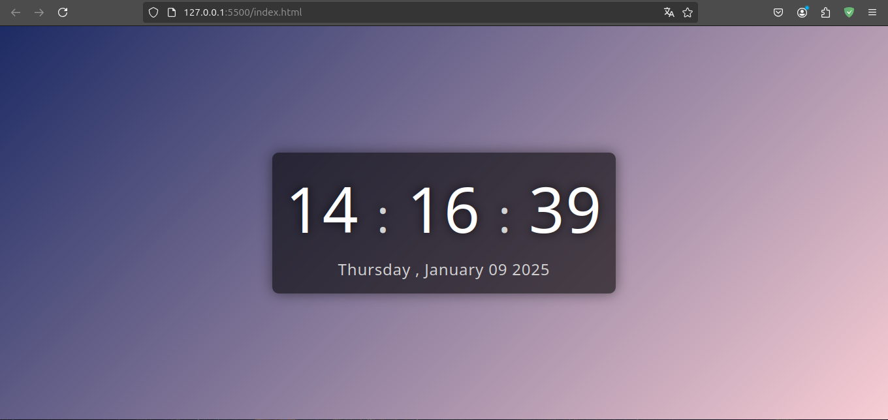

# Digital Clock

A simple and elegant digital clock built with web technologies, featuring real-time time and date display.

## 🚀 Technologies Used

- **HTML5**: For the structural foundation.
- **CSS3**: For styling and layout.
- **JavaScript**: For the clock logic and real-time updates.

## 📂 Project Structure

```text
project-html-css-js-digital-clock/
├── assets/
│   ├── css/
│   │   └── styles.css
│   └── js/
│       └── scripts.js
└── index.html
```

## 🛠️ How to Run

### 1. Cloning the Repository

First, clone the project to your local machine:

```bash
git clone https://github.com/alexandrerogeriosn93/project-html-css-js-digital-clock.git
```

Navigate to the project folder:

```bash
cd project-html-css-js-digital-clock
```

### 2. Execution Options

#### With Live Server (Recommended)

1. Open the project folder in **VS Code**.
2. If you don't have it, install the **Live Server** extension.
3. Right-click on `index.html` and select **"Open with Live Server"**.
4. The project will automatically open in your default browser.

### Without Live Server

1. Navigate to the project directory on your computer.
2. Double-click the `index.html` file.
3. It will open in your default web browser.

## 📸 Preview


